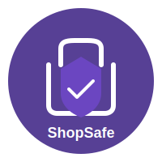

<div align="center">



# ShopSafe

**Secure shopping, smart pricing, fraud-aware from day one.**

[](https://nextjs.org/)
[](https://www.typescriptlang.org/)
[](https://www.sanity.io/)
[](https://stripe.com/)
[](https://clerk.com/)
[](https://www.postgresql.org/)
[](https://www.prisma.io/)
[](https://zustand-demo.pmnd.rs/)
[](https://tailwindcss.com/)
[](https://www.docker.com/)
[](https://nixos.org/)
[](LICENSE)

A production grade e-commerce platform built on Next.js 16, Sanity CMS, Stripe, Clerk, and PostgreSQL. Designed for correctness first secure checkout, idempotent webhooks, serializable cart merges, and a fraud-detection data model baked in from day one.

</div>

---

## Table of Contents

- [Architecture Overview](#architecture-overview)
- [Tech Stack](#tech-stack)
- [Project Structure](#project-structure)
- [Data Flow](#data-flow)
- [Getting Started](#getting-started)
  - [Prerequisites](#prerequisites)
  - [Environment Variables](#environment-variables)
  - [Local Database Setup](#local-database-setup)
  - [Running the App](#running-the-app)
- [Key Design Decisions](#key-design-decisions)
- [Cart System](#cart-system)
- [Authentication & Onboarding](#authentication--onboarding)
- [Payment & Webhooks](#payment--webhooks)
- [Discount & Pricing Model](#discount--pricing-model)
- [Fraud Detection Schema](#fraud-detection-schema)
- [Rate Limiting & CSRF](#rate-limiting--csrf)
- [ISR & Caching Strategy](#isr--caching-strategy)
- [Session Tracking](#session-tracking)
- [Docker](#docker)
- [Scripts Reference](#scripts-reference)
- [API Reference](#api-reference)
- [Contributing](#contributing)
- [License](#license)

---

## Architecture Overview

```
┌─────────────────────────────────────────────────────────────────┐
│                          Browser                                │
│  Zustand (cart) ──► CartSyncWrapper ──► BroadcastChannel        │
│                              │                                  │
│                    Leader Election                              │
└──────────────────────────────┼──────────────────────────────────┘
                               │ HTTPS
┌──────────────────────────────▼──────────────────────────────────┐
│                        Next.js 16                               │
│                                                                 │
│  App Router          API Routes            Middleware           │
│  ├─ (store)/         ├─ /api/cart/*        ├─ Clerk auth        │
│  │  ├─ page.tsx      ├─ /api/user          ├─ Onboarding gate   │
│  │  ├─ product/      ├─ /api/stripe/       └─ Cookie fast-path  │
│  │  ├─ basket/       │   webhook                                │
│  │  ├─ orders/       ├─ /api/orders/                            │
│  │  └─ success/      └─ /api/track-session                      │
│  ├─ (auth)/                                                     │
│  └─ studio/          Server Actions                             │
│                      └─ createCheckoutSession                   │
└───────────┬───────────────────┬─────────────────────────────────┘
            │                   │
     ┌──────▼──────┐    ┌───────▼────────┐
     │  Sanity CMS │    │  PostgreSQL    │
     │  (Content)  │    │  via Prisma    │
     │             │    │                │
     │  Products   │    │  Users         │
     │  Orders     │    │  Sessions      │
     │  Categories │    │  Cart/CartItems│
     │  Sales      │    │  Orders        │
     └─────────────┘    │  Transactions  │
                        │  FraudFlags    │
            ┌───────────│  DataWarehouse │
            │           └────────────────┘
     ┌──────▼──────┐
     │   Stripe    │
     │  Checkout   │
     │  Webhooks   │
     └─────────────┘
```

**Two databases. Intentionally.**

- **Sanity** owns the content layer — products, categories, orders (the customer-facing record), and active sales. It is the source of truth for what a product *is* and what it *costs*.
- **PostgreSQL** owns the operational layer user accounts, sessions, the server-side cart, fraud flags, and a full star-schema data warehouse for analytics. Prisma Accelerate sits in front of it in production for connection pooling.

---

## Tech Stack

| Layer | Choice | Why |
|---|---|---|
|  **Framework** | Next.js 16 (App Router, Turbopack) | RSC + Server Actions remove whole categories of fetch-on-client bugs |
|  **CMS** | Sanity v3 with Live Content API | Real-time content, typed GROQ queries via TypeGen |
|  **Auth** | Clerk | Passkey support, webhooks for user lifecycle, session JWTs |
|  **Payments** | Stripe Checkout | Idempotent sessions, webhook-driven order creation |
|  **ORM** | Prisma 6 | Type-safe schema, migration history, Accelerate compatibility |
|  **Database** | PostgreSQL 16 | SERIALIZABLE transactions for cart merge, advisory locks |
|  **State** | Zustand + persist middleware | Offline-first cart with zero-flash hydration |
|  **Styling** | Tailwind CSS v3 + shadcn/ui | Utility-first, dark mode via class strategy |
|  **Rate Limiting** | Upstash Redis (Ratelimit) | Serverless-safe sliding window, fails open gracefully |
|  **Containerization** | Docker multi-stage build | Slim production image, Prisma engines pre-generated |
|  **Dev Environment** | Nix flake | Reproducible shell, pinned Node 22 + PostgreSQL 16, local `pg_ctl` scripts |

---

## Project Structure

```
.
├── app/
│   ├── (auth)/              # Sign-in, sign-up, onboarding — isolated Clerk theme
│   ├── (store)/             # Main storefront routes
│   │   ├── page.tsx         # Home — ISR 60s
│   │   ├── basket/          # Client cart page
│   │   ├── categories/[slug]/
│   │   ├── orders/          # Server-rendered order history
│   │   ├── product/[slug]/  # ISR 15min per product
│   │   └── success/         # Post-payment polling page
│   ├── api/
│   │   ├── cart/            # GET, POST /sync, POST /merge, POST /clear
│   │   ├── end-session/     # Session lifecycle + Clerk webhook consumer
│   │   ├── orders/check/    # Polling endpoint for success page
│   │   ├── products/by-ids/ # Batch Sanity fetch for cart hydration
│   │   ├── set-onboarded/   # Cookie fast-path after onboarding
│   │   ├── stripe/webhook/  # Idempotent checkout.session.completed handler
│   │   ├── track-session/   # Device/browser session recording
│   │   └── user/            # CRUD — self and admin [id] variants
│   ├── studio/              # Sanity Studio embedded in Next.js
│   └── layout.tsx           # Root: ThemeProvider > ClerkProviderWrapper > SessionProvider
│
├── components/
│   ├── AddToButtons.tsx     # Zero → cart CTA with spinner + trust badges
│   ├── AddToBasketButton.tsx # Stepper (–  N  +) for in-cart state
│   ├── ProductThumb.tsx     # Card with skeleton, discount badge, hover overlay
│   ├── ProductGrid.tsx      # AnimatePresence grid
│   ├── ProductsView.tsx     # Sort + filter toolbar + grid
│   ├── ScrollAwareHeader.tsx # Hide-on-scroll fixed nav
│   └── shared/Topbar.tsx   # Full nav: search, cart, user, passkey, sign-out
│
├── sanity/
│   ├── schemaTypes/         # product, category, order, sale, blockContent
│   └── lib/
│       ├── client.ts        # CDN client (reads)
│       ├── backendClient.ts # Write client (webhook only)
│       ├── live.ts          # defineLive — revalidate: 0
│       └── products/        # getAllProducts, getProductBySlug, search, categories
│       └── sales/           # getActiveSales, getBestDiscount, getByCoupon
│
├── lib/
│   ├── getEffectivePrice.ts # Single pricing function — product discount wins over sale
│   ├── prisma.ts            # Singleton PrismaClient with dev query logging
│   ├── rate-limit.ts        # Upstash wrapper + verifyCsrfOrigin
│   ├── stripe.ts            # server-only Stripe instance
│   └── constants.ts         # MAX_CART_QUANTITY, PAGE_SIZE, revalidate periods
│
├── store/index.ts           # Zustand cart store — the most complex file
├── hooks/
│   ├── useCartSync.ts       # BroadcastChannel leader election + auth-state sync
│   └── useDeviceInfo.ts     # UAParser — client-only, prevents SSR mismatch
│
├── actions/
│   └── createCheckoutSession.ts  # Server Action: fetches live sale price, creates Stripe session
│
├── prisma/
│   ├── schema.prisma        # Full schema including data warehouse star schema
│   ├── migrations/          # Full migration history
│   └── seed.ts              # Deterministic seed with weighted random order statuses
│
└── middleware.ts            # Clerk auth + onboarding gate with cookie fast-path
```

---

## Data Flow

### Adding a Product to Cart

```
User clicks "Add to Cart"
        │
        ▼
useBasketStore.addItem()        ← optimistic, synchronous, instant UI
        │
        ▼
mutateCartItem()                ← single mutation path, clamps to MAX_CART_QUANTITY
        │                          keeps items[] and _persistedItems[] in sync
        ▼
Zustand persist → localStorage  ← _persistedItems only (no Product objects stored)
        │
        ▼ (if signed in)
POST /api/cart/sync             ← fire-and-forget, server mirrors the change
        │
        ▼
prisma.cartItem.upsert()        ← idempotent, clamps quantity server-side too
```

### Checkout

```
User clicks "Secure Checkout"
        │
        ▼
createCheckoutSession()         ← Server Action
        │
        ├─ auth() → assert userId
        ├─ getActiveSales()     ← fresh sale fetch at checkout moment
        ├─ getBestDiscount()
        ├─ getEffectivePrice()  ← per item: product discount wins over sale
        └─ stripe.checkout.sessions.create()
                │
                ▼
        Stripe hosted page
                │
                ▼ (webhook)
POST /api/stripe/webhook
        │
        ├─ stripe.webhooks.constructEvent()   ← signature verification
        ├─ prisma.processedWebhookEvent.create()  ← idempotency key (P2002 = skip)
        ├─ backendClient.createIfNotExists()  ← Sanity order doc, safe on retry
        └─ prisma.cartItem.deleteMany()       ← clear DB cart post-purchase
```

---

## Getting Started

### Prerequisites

-  Node.js 22+
-  PostgreSQL 16+ *(or use the Nix dev shell)*
-  A Sanity project
-  A Clerk application
-  A Stripe account
- -00C389?logo=upstash&logoColor=white&style=flat-square) Optionally: Upstash Redis for rate limiting

The Nix flake (`flake.nix`) gives you a fully pinned dev environment with all of the above managed locally:

```bash
nix develop
```

### Environment Variables

Create `.env.local` at the project root:

```bash
# Sanity
NEXT_PUBLIC_SANITY_PROJECT_ID=your_project_id
NEXT_PUBLIC_SANITY_DATASET=production
NEXT_PUBLIC_SANITY_API_VERSION=2024-01-01
SANITY_API_TOKEN=your_write_token
SANITY_API_READ_TOKEN=your_read_token

# Clerk
NEXT_PUBLIC_CLERK_PUBLISHABLE_KEY=pk_...
CLERK_SECRET_KEY=sk_...
CLERK_WEBHOOK_SECRET=whsec_...

# Stripe
STRIPE_SECRET_KEY=sk_...
STRIPE_WEBHOOK_SECRET=whsec_...

# Database
DATABASE_URL=postgresql://postgres@localhost:5433/shopsafe?host=/path/to/.devdb/run
LOCAL_DATABASE_URL=postgresql://postgres@localhost:5433/shopsafe?host=/path/to/.devdb/run

# App
NEXT_PUBLIC_BASE_URL=http://localhost:3000

# Optional — rate limiting. Fails open (disabled) if not set.
UPSTASH_REDIS_REST_URL=https://...
UPSTASH_REDIS_REST_TOKEN=...
```

> **Note on `DATABASE_URL` vs `LOCAL_DATABASE_URL`:** Migrations can never run through Prisma Accelerate. `LOCAL_DATABASE_URL` always points at a direct socket connection. `DATABASE_URL` may point at an Accelerate proxy in production.

### Local Database Setup

**Using the Nix shell scripts (recommended):**

```bash
db-up          # init cluster + start postgres on port 5433
db-migrate     # prisma migrate deploy against LOCAL_DATABASE_URL
```

**Without Nix:**

```bash
DATABASE_URL="$LOCAL_DATABASE_URL" npx prisma migrate deploy
npx prisma generate
```

**Optional seed** (creates users, products, orders, fraud flags, data warehouse dims):

```bash
npx ts-node --compiler-options '{"module":"CommonJS"}' prisma/seed.ts
```

### Running the App

```bash
npm install
npm run dev          # Turbopack dev server on :3000

# In a separate terminal (to receive Stripe webhooks locally):
stripe-forward       # or: stripe listen --forward-to localhost:3000/api/stripe/webhook
```

Sanity Studio is available at `/studio`.

---

## Key Design Decisions

### Why Two Databases?

Sanity is a content platform. PostgreSQL is an operational database. Mixing product descriptions and fraud scores in the same store would be the wrong abstraction. Sanity handles the CMS workflow — editors, live preview, schema evolution. Postgres handles the transactional workload — cart atomicity, session tracking, fraud flags — where ACID guarantees matter.

Orders exist in both: Sanity holds the customer-facing order document (queried by `getMyOrders`), Postgres holds the operational record for analytics and fraud detection.

### `clerkId` vs `id`

The internal `User.id` is a cuid generated by Prisma. `User.clerkId` is the external Clerk user ID. Every API route resolves `auth().userId` (the Clerk ID) and looks up `prisma.user.findUnique({ where: { clerkId } })`. This decoupling means the internal primary key is stable even if an account is migrated or re-linked.

### Onboarding Gate

Every authenticated request passes through `middleware.ts`. The fast-path: two HTTP-only cookies (`onboarding_complete=1` and `ob_verified=<sessionId>`) skip the DB lookup for the vast majority of requests. On cold start or new session, the middleware redirects to `/api/set-onboarded` which hits Postgres once and sets the cookies.

### Cart Invariant

`items[]` and `_persistedItems[]` are kept in strict sync by a single mutation path (`mutateCartItem`). `items` holds full `Product` objects for rendering. `_persistedItems` holds `{ productId, quantity }` — the only thing persisted to localStorage. The invariant is asserted on every mutation in development.

---

## Cart System

### Multi-Tab Leader Election

When the page loads (or auth state changes), `useCartSync` uses a `BroadcastChannel` to elect a single leader tab. The leader performs the server merge; other tabs receive a `sync_done` message and hydrate from the server directly. This prevents N concurrent merge requests from N open tabs.

### Merge Strategy

On sign-in, local cart and server cart are merged with a **"take the maximum quantity"** strategy. If you have 2 of an item locally and the server says 3 (e.g. from another device), you get 3. The merged result is written to the server via `POST /api/cart/merge`.

The merge endpoint uses a PostgreSQL `SERIALIZABLE` transaction with an advisory lock keyed on a hash of the user's internal ID:

```sql
SELECT pg_advisory_xact_lock(
  ('x' || substr(md5($userId), 1, 16))::bit(64)::bigint
)
```

### Quantity Cap

`MAX_CART_QUANTITY = 99` is enforced in three places: the Zustand store, `/api/cart/sync`, and `/api/cart/merge`. Change the constant in `lib/constants.ts` and it propagates everywhere.

---

## Authentication & Onboarding

New users are created in two possible paths:

1. **`POST /api/track-session`** — fires after Clerk loads, uses session claims to create the user record if an email claim is available.
2. **`POST /api/user`** — the onboarding form. Always creates/updates the user with the verified Clerk email from `currentUser()`. Sets `hasCompletedOnboarding = true` and writes the fast-path cookies.

The middleware ensures no authenticated user reaches any store page without completing onboarding. Passkey creation is available in the navbar for users who haven't enrolled one yet.

---

## Payment & Webhooks

### Idempotency

The Stripe webhook handler inserts a `ProcessedWebhookEvent` row before doing any work. If Stripe retries the delivery, the second attempt hits a unique constraint (`P2002`) and returns `200` immediately without creating a duplicate order.

```typescript
// First delivery: creates row, proceeds
await prisma.processedWebhookEvent.create({ data: { eventId, eventType } });

// Retry: P2002 → caught, early return
if (error.code === "P2002") return;
```

### Price Lock

The price charged by Stripe is computed inside the Server Action **at the moment the user clicks "Checkout"**, not at page render time. `getActiveSales()` is called fresh, closing the race window where a sale expires between page load and payment submission.

---

## Discount & Pricing Model

`getEffectivePrice(product, saleDiscount)` is the single pricing function. It encodes one rule: **product-level discount wins over sitewide sale**.

```
effectiveDiscount = product.discount > 0 ? product.discount : saleDiscount
discountedPrice   = round(originalPrice × (1 − effectiveDiscount/100), 2)
```

Out-of-stock products have `hasDiscount = false` even if a discount applies. Prices are stored in USD dollars and converted to cents for Stripe with `Math.round(price * 100)`.

---

## Fraud Detection Schema

The Postgres schema includes a full fraud detection model:

```
Transaction ──► FraudFlag
                ├─ riskScore: Float   (0–1, from ML model)
                ├─ flagged: Boolean
                ├─ isConfirmedFraud: Boolean
                ├─ source: String     ("ML_MODEL" | "MANUAL")
                └─ reviewNotes: String
```

Alongside a star schema for BI:

```
SalesFact
  ├─ UserDim    (userId, email, region, userType)
  ├─ ProductDim (productId, name, category, price)
  └─ TimeDim    (day, month, quarter, year, isWeekend, isHoliday)
```

The schema is ready for an ML pipeline to populate `FraudFlag.riskScore` and for a BI tool (Metabase, Superset, Redash) to query `SalesFact` directly.

---

## Rate Limiting & CSRF

Rate limiting uses  with a sliding window algorithm. It **fails open** — if `UPSTASH_REDIS_REST_URL` is not set, the limiter returns `null` and the request proceeds.

CSRF protection uses origin header verification (`verifyCsrfOrigin`). All state-mutating endpoints verify the `Origin` header against `NEXT_PUBLIC_BASE_URL`.

---

## ISR & Caching Strategy

| Route | Strategy | TTL |
|---|---|---|
| `/` (home) | ISR | 60 seconds |
| `/product/[slug]` | ISR | 15 minutes |
| `/categories/[slug]` | Dynamic (per-request) | — |
| `/search` | Dynamic | — |
| `/orders` | Dynamic (server, auth-gated) | — |
| Sanity fetches | `revalidate: 0` via `defineLive` | Live |

---

## Session Tracking

Every authenticated page load fires `POST /api/track-session` (from `SessionProvider`). The endpoint:

1. Looks up or creates the user by `clerkId`
2. Finds the most recent active session for that user
3. Creates a new session if none exists, otherwise updates `deviceInfo`

On sign-out, `POST /api/end-session` closes the active session. The Clerk `session.ended` webhook does the same as a backup if the browser tab is closed without a graceful sign-out.

`useDeviceInfo` (via `ua-parser-js`) runs only on the client, avoiding SSR/hydration mismatch.

---

## Docker

The Dockerfile uses a three-stage build:

```
Stage 1 (deps): node:22-bullseye
  - npm ci --prefer-offline
  - prisma generate

Stage 2 (builder): node:22-bullseye
  - copies node_modules from deps stage
  - injects NEXT_PUBLIC_* build args
  - next build → .next/standalone output

Stage 3 (runner): node:22-bullseye
  - non-root user nextjs:1001
  - dumb-init as PID 1 for graceful SIGTERM handling
  - copies .next/standalone, .next/static, public, prisma
  - EXPOSE 3000
  - HEALTHCHECK via http.get /
```

```bash
docker build \
  --build-arg NEXT_PUBLIC_SANITY_PROJECT_ID=xxx \
  --build-arg NEXT_PUBLIC_SANITY_DATASET=production \
  --build-arg NEXT_PUBLIC_SANITY_API_VERSION=2024-01-01 \
  --build-arg NEXT_PUBLIC_BASE_URL=https://yourdomain.com \
  --build-arg NEXT_PUBLIC_CLERK_PUBLISHABLE_KEY=pk_live_xxx \
  -t shopsafe:latest .

docker run -p 3000:3000 --env-file .env.production shopsafe:latest
```

---

## Scripts Reference

These scripts are available in the Nix dev shell (`nix develop`):

| Script | Description |
|---|---|
| `dev-setup` | `npm install` + `prisma generate` |
| `db-up` | Init cluster (first run) + start PostgreSQL on port 5433 |
| `db-down` | Stop PostgreSQL |
| `db-shell` | Open `psql` connected to `shopsafe` |
| `db-migrate` | `prisma migrate deploy` against `LOCAL_DATABASE_URL` |
| `db-reset` | Wipe and re-run all migrations (dev only) |
| `db-studio` | Prisma Studio against local DB |
| `stripe-forward` | Forward Stripe webhooks to `localhost:3000/api/stripe/webhook` |
| `check-env` | Assert all required env vars are present |

Without Nix, the npm scripts cover the essentials:

```bash
npm run dev          # Turbopack dev server
npm run build        # Production build
npm run lint         # ESLint
npm run typegen      # Regenerate sanity.types.ts from schema
```

---

## API Reference

### Cart

| Method | Path | Auth | Description |
|---|---|---|---|
| `GET` | `/api/cart` | Required | Fetch server cart items |
| `POST` | `/api/cart/sync` | Required | Add or remove one item. Rate-limited 30 req/min. |
| `POST` | `/api/cart/merge` | Required | Full cart merge with serializable transaction |
| `POST` | `/api/cart/clear` | Required | Delete all cart items |

### User

| Method | Path | Auth | Description |
|---|---|---|---|
| `GET` | `/api/user` | Required | Fetch own profile |
| `POST` | `/api/user` | Required | Create or update profile (onboarding). Rate-limited 5 req/min. |
| `GET` | `/api/user/[id]` | Admin only | Fetch any user by internal Prisma ID |

### Orders

| Method | Path | Auth | Description |
|---|---|---|---|
| `GET` | `/api/orders/check?orderNumber=` | Required | Poll for order existence in Sanity (used by success page) |

### Products

| Method | Path | Auth | Description |
|---|---|---|---|
| `POST` | `/api/products/by-ids` | None | Batch fetch Sanity products by ID array (max 100) |

### Sessions & Webhooks

| Method | Path | Auth | Description |
|---|---|---|---|
| `POST` | `/api/track-session` | Required | Record device info, create/update session. Rate-limited 10 req/min. |
| `POST` | `/api/end-session` | Required | Close active session on sign-out |
| `POST` | `/api/end-session/webhook` | Svix sig | Clerk webhook: `session.ended`, `user.deleted` |
| `POST` | `/api/stripe/webhook` | Stripe sig | Stripe webhook: `checkout.session.completed` |
| `GET` | `/api/set-onboarded` | Required | Middleware redirect: verify onboarding, set cookies |

---

## Contributing

The codebase has a few hard rules:

- **One mutation path.** All cart mutations go through `mutateCartItem`. Do not reach into `items` or `_persistedItems` directly.
- **One pricing function.** All discount logic lives in `getEffectivePrice`. Do not inline discount math anywhere else.
- **Migrations over raw SQL.** Every schema change needs a Prisma migration. `LOCAL_DATABASE_URL` is for migration targets. Never point `prisma migrate` at an Accelerate URL.
- **Server-only secrets.** `lib/stripe.ts` imports `server-only`. Do not import it from client components.
- **No role in the user form.** `POST /api/user` accepts only `name` and `address`. Role is set server-side to `CUSTOMER` on create and is never updatable via this route.

```bash
# Before opening a PR
npm run lint
npm run build        # catches type errors that lint misses
npm run typegen      # if you touched any Sanity schema or GROQ queries
```

---

## License

This project is licensed under the **GNU Affero General Public License v3.0**.

If you run a modified version of ShopSafe as a network service, you must make your modified source available under the same license.

For commercial licensing (closed-source deployments), contact: [haiderkhan6410@gmail.com](mailto:haiderkhan6410@gmail.com)

---

<div align="center">

Made with ❤️ by [Haider Khan](https://github.com/Haiderkhan64)

[](https://github.com/Haiderkhan64/ShopSafe)

</div>
